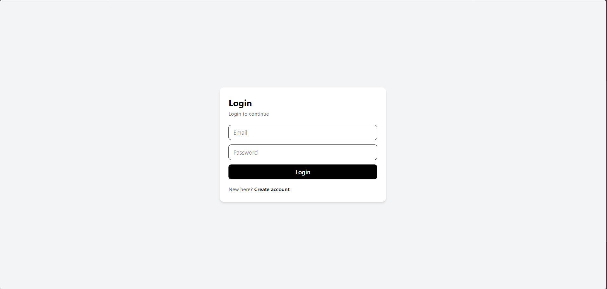
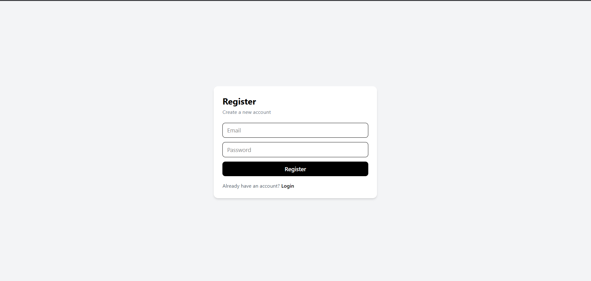
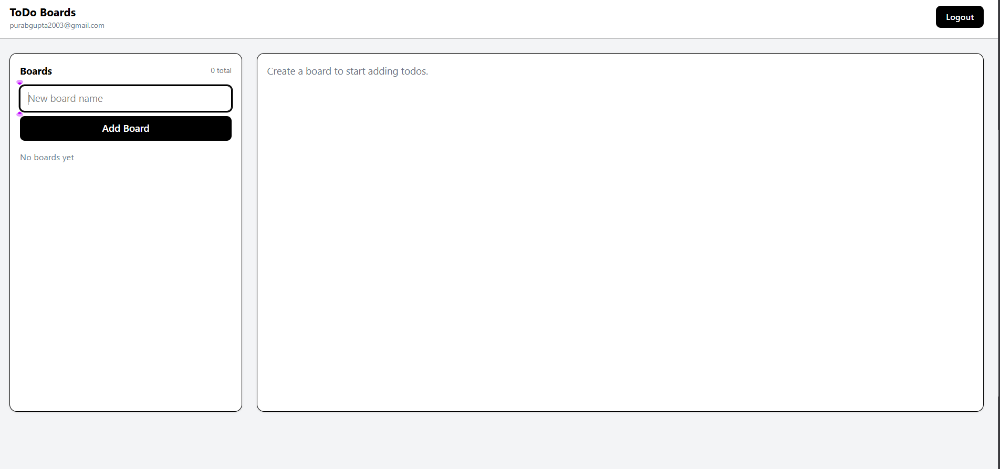
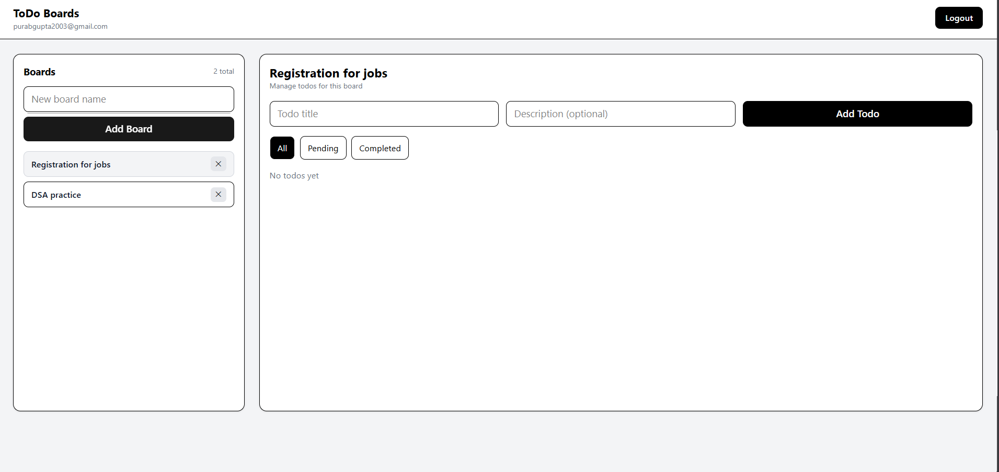
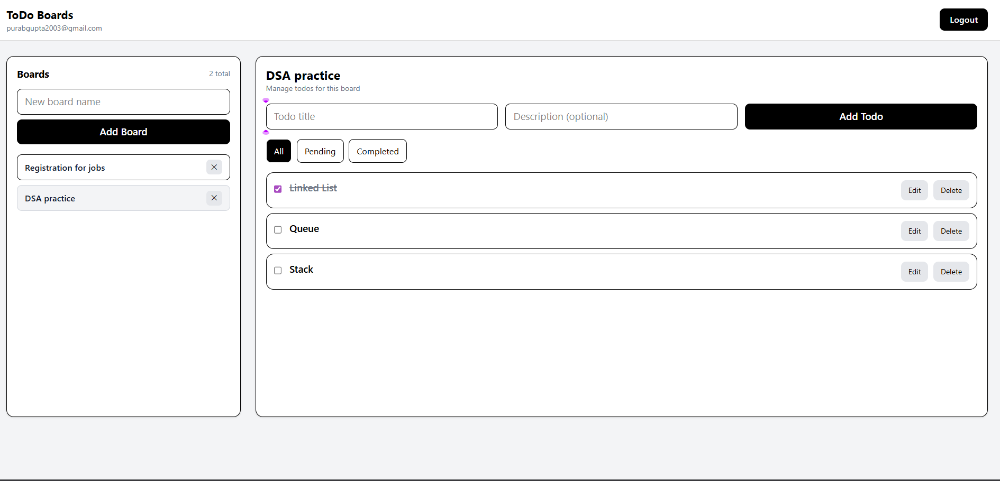
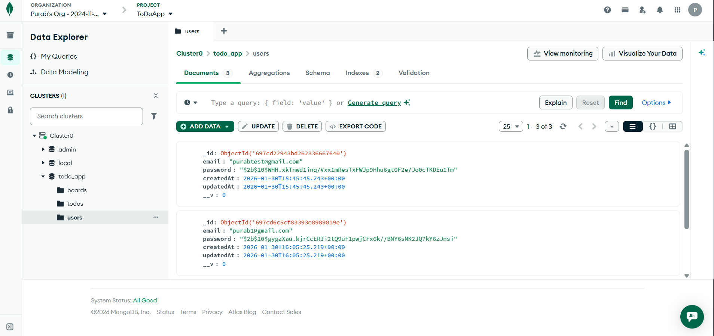

# To-Do Web App (Boards + Todos)

A full stack task management web application where users can create boards and manage to-dos inside each board.

Built as part of a **Full Stack Developer Technical Assessment**.

---

## Features

### Authentication
- Register with email and password
- Login with email and password
- JWT-based authentication
- Protected routes (Boards/Todos require login)

### Boards
- Create board
- View all boards
- Delete board

### Todos
- Create todo inside selected board
- Update todo (Edit todo title + description)
- Mark todo as completed / pending
- Delete todo
- Filter todos (All / Pending / Completed)

### Data Handling
- Boards and Todos are **user-specific**
- Users cannot access boards/todos of other users (user-scoped API)

---

## Tech Stack

**Frontend**
- React.js (Vite)
- Tailwind CSS
- Axios

**Backend**
- Node.js
- Express.js
- JWT Authentication

**Database**
- MongoDB (MongoDB Atlas)

---

## Screenshots

### Login Page


### Register Page


### Dashboard


### Boards View


### Todos View


### Database (MongoDB)



> Screenshots are stored in the `screenshots/` folder.

### Login


### Register


### Dashboard (Boards + Todos)


### Edit Todo


---

## Folder Structure

```txt
ToDoApp/
├── client/                 # React frontend
├── server/                 # Node/Express backend
├── screenshots/            # README screenshots
└── README.md
